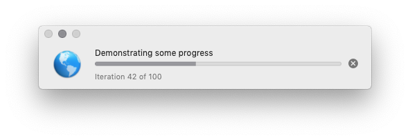

# Progress

Scriptable macOS application to show and control progress indicators



## Installation

A ready-made, code-signed and notarized build of this project can be downloaded from [here](https://adriannier.de/downloads/Progress_1.0.1.28.zip).

## Usage with AppleScript

Run one of the demonstration scripts in the `scripts` directory of this repository for an example on how to create and control progress indicators. 

Basic syntax is:

```
tell application "Progress"
    set myIndicator to make new indicator with properties {visible:true, title:"Processing…"}
end tell

repeat with i from 1 to 100
    
    -- Do something
    
    tell application "Progress" to tell myIndicator
        set percentage to i
    end tell
    
end repeat

tell application "Progress" to tell myIndicator
    set title to "Done"
end tell

```
When the `percentage` is set to a value below zero an indeterminate progress is displayed. 

The `indicator` is automatically set to be complete when the `percentage` reaches 100. No further `percentage` updates except with `-1` are allowed past this point.

If there are no updates to a newly created `indicator` for 15 seconds, the user is presented with a cancel button. 

If the cancel button is pressed your script has another 15 seconds to finish processing otherwise the user will be able to close the `indicator`.

## Usage without AppleScript

If you would like to show an indicator without AppleScript then start the application from the command line or in a shell script with two arguments each pointing to a `.json` file.

**First argument**: Path to data file

Example:
```
{
    "percentage": -1,
    "title": "This is the title",
    "message": "This is a descriptive message",
    "icon": "/System/Library/CoreServices/Dock.app/Contents/Resources/url@2x.png"
}
```
As long as the user does not cancel the progress, this file is checked every second for changes to be mirrored by the indicator.

**Second argument**: Path to `cancel-file`

Example
```
#!/bin/bash

~/Downloads/Progress.app/Contents/MacOS/Progress ~/Downloads/swift-progress/json/progress.json ~/Downloads/swift-progress/_cancel.json

```

Once the user presses the cancel button the `cancel-file` is created to give your application or script a chance to know of the user’s intent. At this point you are encouraged to delete the `cancel-file` which will update the indicator accordingly. If the `cancel-file` does not disappear within 15 seconds, the user is allowed to close the progress indicator and the `cancel-file` is deleted.

## Building

This project was successfully build with Xcode 11.3.1 and Swift 5 on macOS 10.14.6.
